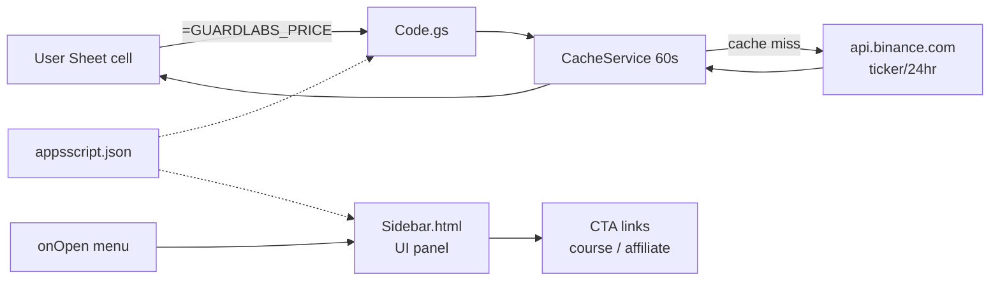

# GuardLabs Trading Toolkit — Apps Script add-on

Файлы для публикации в Google Apps Script.

## Архитектура



3 pure-JS функции + sidebar UI + onOpen menu. Никаких внешних зависимостей кроме `api.binance.com` (whitelisted в manifest).

## Что это

Workspace Add-on для Google Sheets с 3 custom functions:

```
=GUARDLABS_PRICE("BTC")            # current price (default 'p')
=GUARDLABS_PRICE("BTC", "h")       # 24h high
=GUARDLABS_PRICE("BTC", "l")       # 24h low
=GUARDLABS_PRICE("BTC", "c")       # 24h % change
=GUARDLABS_PRICE("BTC", "v")       # 24h volume USDT

=GUARDLABS_RISK(equity, risk_pct, entry, sl)
=GUARDLABS_RISK(10000, 1, 67000, 66000)  → ~10 USDT position

=GUARDLABS_GRID(low, high, levels)
=GUARDLABS_GRID(60000, 70000, 10)  → 10 grid levels (returns 10×1 array)
```

Sidebar (правая панель) с примерами + 2 CTA-кнопки → nexus-bot.pro и /partners?ref=appsscript.

## Файлы в этой папке

- `Code.gs` — server-side Apps Script: 3 custom functions + onOpen + showSidebar + onHomepage card
- `Sidebar.html` — UI sidebar dark-theme HTML
- `appsscript.json` — manifest

## Как опубликовать (8 минут UI ручной работы)

Apps Script API разрешает деплой только через `clasp` (CLI) с OAuth-flow от пользователя — на сервере без UI это сложнее чем 8 минут руками.

### Шаги

1. https://script.google.com/home → **Новый проект**
2. Назвать **«GuardLabs Trading Toolkit»**
3. **Project Settings (шестерёнка)** → включить **«Show appsscript.json manifest file in editor»**
4. **Editor** → удалить дефолтный код в `Code.gs` → вставить содержимое `Code.gs` из этой папки → **Save**
5. **«+ Add file» → HTML** → имя `Sidebar` (без `.html`) → вставить содержимое `Sidebar.html` → Save
6. Кликнуть на **`appsscript.json`** в списке → заменить весь контент на наш manifest → Save
7. **Deploy → Test deployments** → **Install** для теста (откроется в Sheets)
8. Открыть любую Google Sheet → проверить меню «GuardLabs Toolkit», `=GUARDLABS_PRICE("BTC")` в ячейке

### Публикация для других (2 пути)

**A. Unlisted (быстро, без модерации):**
   - Deploy → New deployment → Type: Add-on → Manifest version и описание
   - Получите ссылку для установки: `https://workspace.google.com/marketplace/app/...`
   - Раздавать её через Reddit `/r/algotrading`, GitHub Gist, в footer guardlabs.online/trading/

**B. Public listing (модерация 7-14 дней):**
   - Подать на Google Workspace Marketplace publishing
   - Требования: privacy policy, terms, иконки 96px+128px+512px, минимум 3 скриншота, GIF tour
   - Подача: https://developers.google.com/workspace/marketplace/listing

## Связанное

- `/root/promo_mvp/APPS_SCRIPT_PLAN.md` — стратегия публикации
- `/root/promo_mvp/PLAYBOOK.md` — техника #3 в «Тайные тропы Google»

## Журнал

- 2026-05-02 — код сгенерирован через Gemini Pro 2.5 ($0.07), 1174 слов. Готов к копированию в Apps Script Editor.
